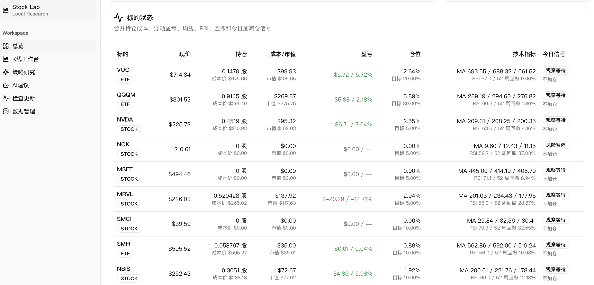

<a id="中文"></a>

# 美股定投交易日记

[中文](#中文) | [English](#english)

## 项目特色

每天的交易记录和与 AI 的对话，都可以像日历一样保存起来，之后按日期点击查看，方便持续复盘自己的投资过程。



项目演示录屏：

<video src="docs/screenshots/demo.mov" controls muted playsinline width="100%"></video>

> 如果你的 Markdown 阅读器不支持内嵌视频，也可以直接打开 [录屏文件](docs/screenshots/demo.mov)。

这是一个本地运行的美股研究和交易辅助工具。它会在你的电脑上打开网页界面，用来查看自选股、K 线图、账户概览、策略信号、回测结果和 AI 建议。

数据默认保存在自己的电脑里，不会自动上传到云端。公开版本只带示例数据，不包含真实账户、持仓、交易记录或 API 密钥。

## 适合谁使用

- 想用网页界面管理自选股、交易记录和 AI 对话的人。
- 想查看日 K、周 K、月 K、1 日分时、5 日分时的人。
- 想把私密交易数据保存在本地的人。
- 不熟悉命令行也可以使用：下载对应系统的压缩包，解压后双击启动。

## 下载

请到 [Release 页面](https://github.com/maoqiu77/stock-trading-platform-next/releases) 下载：

- Windows：`stock-trading-platform-next-v0.1.9-windows-x64.zip`
- Apple 芯片 Mac（M1/M2/M3/M4）：`stock-trading-platform-next-v0.1.9-macos-arm64.zip`
- Intel 芯片 Mac：`stock-trading-platform-next-v0.1.9-macos-x64.zip`

不要下载 GitHub 自动生成的 `Source code (zip)`，它是源码包，不是一键运行包。

## Windows 使用方法

1. 下载 Windows 压缩包并选择“全部解压”。
2. 打开解压后的文件夹，双击 `启动股票交易平台.exe`。
3. 等待浏览器打开 `http://127.0.0.1:3000/`。

使用期间请保持黑色控制台窗口打开，关闭后本地服务会停止。

## macOS 使用方法

1. 下载适合自己芯片的 macOS 压缩包并解压。
2. 双击 `启动股票交易平台.command`。
3. 等待浏览器打开 `http://127.0.0.1:3000/`。

如果 macOS 阻止启动，请右键点击文件，选择“打开”，再在确认弹窗中选择“打开”。使用期间请保持终端窗口打开。

## 手机或平板访问

电脑和移动设备连接同一个 Wi-Fi 后，在手机浏览器访问电脑的局域网地址，例如：

```text
http://192.168.1.20:3000
```

这是响应式网页端，不是原生 iOS/Android App。

## 数据保存在哪里

私有运行数据保存在 `storage/local/`，可能包含账户金额、持仓、交易记录和 AI 设置。备份或分享项目时不要提交这个目录。公开示例数据位于 `storage/templates/`。

## 评测 AI 是否理解投资上下文

项目提供包含 20 个虚构案例的离线评测工具，用于检验 AI 是否准确使用账户上下文、遵守长期投资约束并符合用户的投资方式。

```bash
mkdir -p storage/local/evaluations
cp storage/templates/ai-context-evaluation.example.yaml \
  storage/local/evaluations/ai-context-evaluation.yaml
./scripts/evaluate_ai_context.py \
  storage/local/evaluations/ai-context-evaluation.yaml
```

详见 [AI 投资上下文评测指南](docs/ai-context-evaluation.md)。

## 给开发者

```bash
python3 -m venv .venv
source .venv/bin/activate
pip install -r apps/api/requirements.txt
npm --prefix apps/web install
npm run dev:api
npm run dev:web
```

发布前运行 `npm run check:public-safety`、`npm run check:release-readiness`、`npm --prefix apps/web run lint` 和 `npm --prefix apps/web run build`。

## 参与贡献与安全

提交 Pull Request 前请阅读 [CONTRIBUTING.md](CONTRIBUTING.md)，不要包含真实账户、投资组合、交易记录、API 密钥、日志或本地数据库。漏洞和敏感数据请按照 [SECURITY.md](SECURITY.md) 中的说明私密报告。

## 维护者与许可证

本仓库由 [@maoqiu77](https://github.com/maoqiu77) 创建并主要维护。本项目采用 [Apache License 2.0](LICENSE) 许可证。

---

<a id="english"></a>

# 美股定投交易日记

[中文](#中文) | [English](#english)

## Highlights

Daily trades and AI conversations can be saved in a calendar-like journal. Click any date later to review what happened and continue your investment reflection.


Demo recording:

<video src="docs/screenshots/demo.mov" controls muted playsinline width="100%"></video>

> If your Markdown viewer cannot embed video, open the [recording file](docs/screenshots/demo.mov) directly.

This is a local stock research and trading-assistance tool for watchlists, candlestick charts, account summaries, strategy signals, backtests, and AI-generated advice.

Data is stored on your computer by default and is not automatically uploaded to the cloud. Public releases contain sample data only and do not include real accounts, positions, trade records, or API keys.

## Download

Download a ready-to-run package from the [Releases page](https://github.com/maoqiu77/stock-trading-platform-next/releases):

- Windows: `stock-trading-platform-next-v0.1.9-windows-x64.zip`
- Apple Silicon Mac: `stock-trading-platform-next-v0.1.9-macos-arm64.zip`
- Intel Mac: `stock-trading-platform-next-v0.1.9-macos-x64.zip`

Do not download GitHub's automatically generated `Source code (zip)` archive; it is for developers, not end users.

## Run the application

On Windows, extract the package, double-click `启动股票交易平台.exe`, and keep the console window open. On macOS, extract the package, double-click `启动股票交易平台.command`, and use **Right-click → Open** if Gatekeeper asks for confirmation. The browser opens at `http://127.0.0.1:3000/`.

The responsive web interface can also be opened from a phone or tablet on the same Wi-Fi network using the computer's local IP address.

## Data and development

Private runtime data belongs in `storage/local/`; public examples belong in `storage/templates/`. Never publish real portfolio data, trading logs, account identifiers, API keys, cookies, or local databases.

For source development, create a Python virtual environment, install `apps/api/requirements.txt`, install web dependencies with `npm --prefix apps/web install`, then run `npm run dev:api` and `npm run dev:web`. See [CONTRIBUTING.md](CONTRIBUTING.md), [SECURITY.md](SECURITY.md), and the [AI context evaluation guide](docs/ai-context-evaluation.md) for more information.

Licensed under the [Apache License 2.0](LICENSE).
