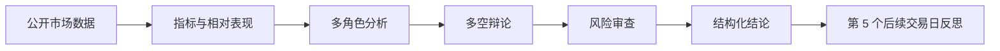
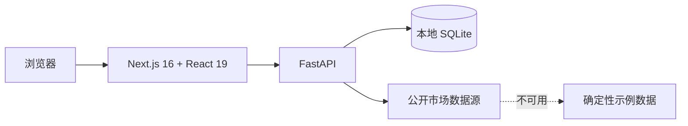

<a id="中文"></a>

<h1 align="center">美股定投交易日记 · 量化分析</h1>

<p align="center">
  <strong>把持仓、行情、策略、AI 研究与交易复盘留在自己电脑上的本地投资工作台</strong>
</p>

<p align="center">
  <a href="https://github.com/maoqiu77/us-stock-dca-journal/releases"></a>
  <a href="LICENSE"></a>
  
  
  
  
</p>

<p align="center">
  <a href="#中文">中文</a> · <a href="#english">English</a>
  <br>
  <a href="#核心能力">核心能力</a> · <a href="#产品界面">产品界面</a> · <a href="#下载与运行">下载与运行</a> · <a href="#量化分析">量化分析</a> · <a href="#开发指南">开发指南</a>
</p>

---

这是一款面向美股个股与 ETF 的本地投资研究和交易复盘工具。它将账户概览、K 线、策略信号、回测、AI 建议和多智能体量化分析收进同一个网页工作台，并把每天的操作与对话整理成可回看的投资日历。

> [!NOTE]
> 项目不是券商客户端，不连接账户执行交易。即使外部行情或研究数据暂时不可用，界面也会降级到明确标注的确定性示例数据，方便继续体验和开发。

> [!WARNING]
> 本项目不会自动下单，所有量化结果与 AI 内容仅用于研究和复盘，不构成投资建议。请独立判断并自行承担投资风险。

## 核心能力

| | 能力 | 你可以做什么 |
| --- | --- | --- |
| 📊 | **账户总览** | 汇总持仓成本、市值、浮动盈亏、目标仓位、均线、RSI、回撤与当日信号 |
| 📈 | **K 线工作台** | 查看 1 日、5 日、日 K、周 K、月 K，叠加成交量、MA20/60/120/200 与交易标记 |
| 🧭 | **策略研究** | 配置 ETF / 核心仓 / 卫星仓规则，对比买入持有、定投、MA 风控与回调加仓回测 |
| ✨ | **AI 建议日历** | 生成每日建议、连续追问，并按日期回看交易操作、AI 判断与后续对话 |
| 🧠 | **量化分析** | 先计算可复算指标，再由多角色分析、辩论和风险审查生成结构化研究报告 |
| 🔒 | **本地数据管理** | 管理股票池、交易流水、持仓目标和 AI Provider；支持 CSV / TSV 与持仓截图导入 |

## 产品界面


<p align="center">
  总览、K 线、策略研究、AI 建议与量化分析共享同一套本地数据<br>
  <a href="https://github.com/user-attachments/assets/d07989b2-8ad5-490d-a9b6-327f87805320"><strong>▶ 在线观看演示</strong></a>
  ·
  <a href="docs/screenshots/demo.mp4">下载 MP4 录屏</a>
</p>

## 为什么做这个项目

多数行情工具擅长展示价格，却很难保存“当时为什么做这个决定”；通用 AI 又往往缺少持仓、策略和历史对话的连续上下文。本项目把两部分连在一起：

- **研究有依据**：量化指标和相对表现可复算，AI 负责解释和讨论，不冒充事实来源。
- **决策可回看**：交易记录、每日建议和追问按日期归档，方便复盘判断而不只是查看盈亏。
- **数据有边界**：公开市场研究与私密账户上下文分开处理，发送前有明确提示，密钥只在本机保存。
- **日常能使用**：外部数据源失败时提供可识别的 sample 降级，避免整个界面不可用。

## 下载与运行

前往 [Releases](https://github.com/maoqiu77/us-stock-dca-journal/releases) 下载当前稳定版。请不要下载 GitHub 自动生成的 `Source code (zip)`，那是源码，不是一键运行包。

| 系统 | v1.3.0 安装包 | 启动方式 |
| --- | --- | --- |
| Windows x64 | `stock-trading-platform-next-v1.3.0-windows-x64.zip` | 双击 `启动股票交易平台.exe` |
| macOS Apple 芯片 | `stock-trading-platform-next-v1.3.0-macos-arm64.zip` | 双击 `启动股票交易平台.command` |
| macOS Intel 芯片 | `stock-trading-platform-next-v1.3.0-macos-x64.zip` | 双击 `启动股票交易平台.command` |

1. 下载与电脑匹配的压缩包并**完整解压**。
2. 双击启动文件，等待浏览器打开 <http://127.0.0.1:3000/>。
3. 使用期间保持控制台或终端窗口开启；关闭窗口会停止本地服务。

如果 macOS 首次阻止运行，请右键启动文件，选择“打开”，再确认一次。电脑和移动设备处于同一 Wi-Fi 时，也可以在手机或平板访问电脑的局域网地址，例如 `http://192.168.1.20:3000`。

<details>
<summary><strong>v1.3.0 更新摘要</strong></summary>

- AI 连接改为服务商配置，支持第三方 API、DeepSeek、Kimi、GLM、OpenAI、Claude、通义千问、MiniMax 和硅基流动。
- 不同服务商分别保存本地配置与密钥，支持 Chat Completions、Responses 和 Anthropic Messages 协议。
- 连接测试返回的模型会加入输入建议，同时保留未知模型的手动输入能力。
- 左侧导航将“数据管理”更名为“交易记录”，并将“AI 日历”调整到“量化分析”之前。
- 发布包继续只包含示例数据，不包含真实账户、交易记录、密钥或本地数据库。

</details>

## 隐私与数据边界

> [!IMPORTANT]
> 私有运行数据默认写入 `storage/local/`，该目录已被 Git 忽略。公开示例位于 `storage/templates/`。备份、截图或提交代码前，仍应确认其中不含真实账户信息、交易流水、券商导出文件、API Key、Cookie 或数据库。

| 数据类型 | 默认位置 | 是否可提交 |
| --- | --- | --- |
| 示例自选股、虚构评测数据 | `storage/templates/` | 可以，但必须是合成数据 |
| 账户、持仓、交易流水、AI 记录 | `storage/local/app.db` | **不可以** |
| AI / FRED Key 与本地设置 | `storage/local/` | **不可以** |
| 量化报告、运行阶段与反思 | `storage/local/quant-analysis/`、本地 SQLite | **不可以** |

AI 建议与量化分析遵循不同的数据范围：

- **AI 建议**可以在用户确认后发送账户、持仓、交易与策略上下文到用户选择的 AI 服务商。
- **量化分析**只发送标的代码、公开市场数据和公开新闻摘要，不发送账户余额、持仓、现金或交易流水。
- 外部行情被降级为 `sample` 时只用于界面预览，不会作为真实依据发送给 AI。

## AI 连接设置

在「AI 模型配置」中先选择服务商，再输入 API 密钥。支持第三方 API、DeepSeek、Kimi、GLM、OpenAI、Claude、通义千问、MiniMax 和硅基流动。官方预设使用普通 API 地址和默认模型，通常只需填密钥；国内平台预设使用中国区地址，其他地区或专用套餐请使用第三方配置。

「高级设置」可更换复杂／简单任务模型及受支持的协议。第三方支持自动检测、Chat Completions、Responses 和 Anthropic Messages；测试连接成功后，返回的模型列表也会加入模型输入框建议。未知模型可手动输入，实际可用性以服务商和连接测试为准。

每个服务商的配置和密钥分别保存在本机，旧配置自动归入第三方 API。切换服务商不会混用密钥；更换第三方地址后需重新输入密钥。识别持仓截图需要支持图片的简单任务模型，文字连接测试不验证图片能力。

## 量化分析

量化分析支持 Yahoo 可识别的美国个股和 ETF，并明确分开“可复算事实”和“非确定性研判”。



可复算层包括均线、RSI、MACD、布林带、ATR、VWMA、回撤和相对 SPY 收益。AI 层可以组合技术面、基本面或 ETF 结构、新闻、社交情绪和宏观事件，再经过多空讨论与风险评估形成研究结论。

历史分析不会混入当前基本面快照、当前社交情绪或当前 Polymarket 数据。配置 FRED Key 时，宏观序列会固定到分析日期对应的数据 vintage。快速模式通常需要“分析师数量 + 8”次 AI 调用，深度模式通常需要“分析师数量 + 18”次；结构化 JSON 修复可能额外调用一次。

多角色研究流程参考了 [TauricResearch/TradingAgents](https://github.com/TauricResearch/TradingAgents) 的角色分工与研究辩论思路。本项目没有安装或打包 TradingAgents，而是在 Next.js + FastAPI 架构和本地隐私边界内独立实现。详见 [第三方说明](THIRD_PARTY_NOTICES.md)。

## 技术架构



| 目录 | 职责 |
| --- | --- |
| `apps/web` | Next.js、React、shadcn/ui、TanStack Query 与 Lightweight Charts |
| `apps/api` | FastAPI、本地数据、行情适配、指标、回测与 AI 工作流 |
| `storage/templates` | 可公开的合成示例和配置模板 |
| `storage/local` | 被 Git 忽略的私有运行数据 |
| `scripts` | 启动、迁移、发布与公开安全检查 |

## 开发指南

开发环境需要 **Python 3.12+** 和 **Node.js 24**。

```bash
python3 -m venv .venv
source .venv/bin/activate
python -m pip install -r apps/api/requirements.txt
npm --prefix apps/web ci
```

分别启动 API 和网页端：

```bash
npm run dev:api
npm run dev:web
```

网页端默认位于 <http://127.0.0.1:3000/>，API 默认位于 <http://127.0.0.1:8000/>。提交前运行完整检查：

```bash
npm run check
```

离线 AI 投资上下文评测包含 20 个虚构案例，使用方式见 [评测指南](docs/ai-context-evaluation.md)。参与开发前请阅读 [贡献指南](CONTRIBUTING.md)；安全问题请按照 [安全策略](SECURITY.md) 私密报告。

## 维护与许可

本仓库由 [@maoqiu77](https://github.com/maoqiu77) 创建并主要维护，基于 [Apache License 2.0](LICENSE) 开源。

---

<a id="english"></a>

# US Stock DCA Journal + Quant Analysis

> A local-first workspace for US stock and ETF research, portfolio journaling, strategy review, and AI-assisted analysis.

[中文](#中文) | [English](#english)

The project brings portfolio status, candlestick charts, strategy signals, backtests, daily AI conversations, and multi-agent quantitative research into one local web application. It does not connect to a broker or place trades.

## Highlights

- **One workspace:** portfolio overview, 1D / 5D / daily / weekly / monthly charts, strategy research, AI advice, and quant analysis.
- **Reproducible first:** indicators and relative performance are calculated before non-deterministic AI interpretation.
- **Decisions with history:** trades, daily advice, and follow-up conversations are organized in a browsable calendar.
- **Local by default:** private runtime data and provider keys stay under the gitignored `storage/local/` directory.
- **Resilient UI:** external market providers degrade to clearly labeled deterministic sample data when unavailable.

> [!WARNING]
> This project is for research and journaling only. It never places trades, and its quantitative or AI-generated output is not investment advice.

## Download

Get a ready-to-run package from [GitHub Releases](https://github.com/maoqiu77/us-stock-dca-journal/releases):

| Platform | v1.3.0 package |
| --- | --- |
| Windows x64 | `stock-trading-platform-next-v1.3.0-windows-x64.zip` |
| macOS Apple Silicon | `stock-trading-platform-next-v1.3.0-macos-arm64.zip` |
| macOS Intel | `stock-trading-platform-next-v1.3.0-macos-x64.zip` |

Extract the archive, then open `启动股票交易平台.exe` on Windows or `启动股票交易平台.command` on macOS. Keep the terminal window open while using the app. The browser will open at <http://127.0.0.1:3000/>.

Do not use GitHub's automatically generated `Source code (zip)` archive unless you intend to set up a development environment.

## Privacy model

Public synthetic examples live in `storage/templates/`. Accounts, positions, trades, AI conversations, provider keys, research reports, and local databases belong in `storage/local/` and must never be committed.

Daily AI advice may send private investment context only after explicit confirmation. Quant Analysis sends public symbol, market, and news data only; it never sends balances, positions, cash, or trade history. Sample fallback data is never presented to AI as real market evidence.

## Development

Python 3.12+ and Node.js 24 are required.

```bash
python3 -m venv .venv
source .venv/bin/activate
python -m pip install -r apps/api/requirements.txt
npm --prefix apps/web ci
npm run dev:api
npm run dev:web
```

Run `npm run check` before submitting a pull request. See [CONTRIBUTING.md](CONTRIBUTING.md), [SECURITY.md](SECURITY.md), and [THIRD_PARTY_NOTICES.md](THIRD_PARTY_NOTICES.md) for contribution, security, and attribution details.

Licensed under the [Apache License 2.0](LICENSE).
