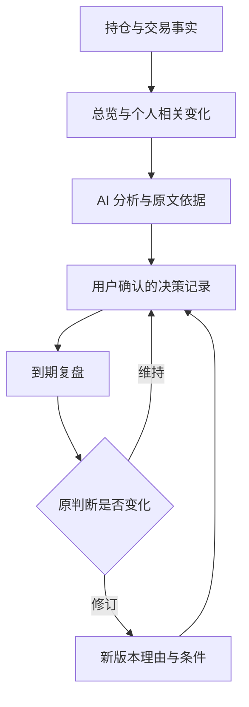

# 持仓手记 / AI Portfolio Copilot：全面项目审查与产品优化实施计划

> 审查日期：2026-10-03（北京时间）  
> 仓库：https://github.com/maoqiu77/us-stock-dca-journal  
> 审查基线：`main`，`61e90f72ea712f0145ec558b09dddf1cc29b945a`  
> 基线提交：2026-10-02 01:03:47 +08:00，`feat: add bounded AI journal agent and local runtime launcher`  
> 本文用途：产品决策、代码整改和 Codex 分阶段实施。此次只审查并生成文档，没有修改业务代码、提交、推送、部署或调用付费模型。

## 1. 最重要的结论

**这个项目已经有较扎实的本地数据和 AI 研究基础，下一步应把“功能齐全”推进到“普通用户每天能顺手完成一件事”。最值得投入的主线是：可靠的持仓总览 → 与自己相关的市场变化 → 有依据的 AI 分析 → 留下判断 → 到期复盘。**

目前最有价值的资产不是更多技术指标，而是已经积累的持仓、交易理由、手记、历史对话及其证据关系。AI 日历应该成为这些内容的使用入口，让用户逐渐感到“这个工具理解我为什么持有”，而不只是“它又生成了一段市场评论”。

建议优先完成五件事：

1. **先让数字可信。** 修正总览的盈亏名称、行情缺失时的估值和覆盖率，处理截图持仓与真实交易的区别，给保存状态和备份恢复明确入口。
2. **把 AI 日历整理成一个对话工作区。** 保留一个提问框，统一显示分析、引用和追问；修好日期选择、手记打开、失败任务重开、刷新恢复。
3. **让 AI 的记忆对用户可见、可更正。** 明确本轮参考了哪些持仓、哪几条原文、截至什么时候；先增强现有检索，不急于更换向量数据库。
4. **给总览和看板明确分工。** 总览回答“我的组合现在怎样”，看板回答“我关注的市场发生了什么”；通过同一标的详情和带上下文的跳转连接起来。
5. **让其他人装好就能理解、理解后能用。** 统一产品名称和入口文档，补齐 Agent 的安装、检测和启用流程，用干净环境验证发行包。

不建议近期同时推进复杂云同步、完整原生 App、多 Agent 辩论、自动交易和泛化财经资讯流。它们会增加成本，却不能优先解决当前主流程的问题。

### 1.1 推荐的下一版本承诺

对新用户：**三分钟内建立第一份持仓记录，知道数据是否可靠，留下第一条投资判断。**

对回访用户：**三十秒看清组合状态，一分钟找到相关变化，三分钟完成一次有依据的记录或复盘。**

以上是待验证的产品目标，不是本轮测得的使用时长。

## 2. 审查范围与证据边界

### 2.1 本轮实际做了什么

- 下载并固定当前 `main` 的完整源码快照，阅读根目录和 Web 的 `AGENTS.md`。
- 重点审查 Web 总览、市场看板、AI 日历、交易录入、截图导入、模型配置、页面状态与持久化。
- 追踪 FastAPI 的行情服务、AI 快照、日历聚合、Agent 执行、个人原文检索、来源校验、账本与隐私门控。
- 横向检查微信小程序、AI 网关、共享 domain / ai-context / market-data，以及历史 Expo 路线。
- 检查 CI、发行包、启动器和最新 Agent 验收记录；运行现有离线测试、类型检查、构建及公开安全检查。
- 使用合成数据复现“看板断网返回 sample”和“总览缺行情按成本补估值”两条路径。

### 2.2 没有把哪些事情当成已验证

- 本轮没有在真实用户电脑上进行浏览器视觉走查，没有微信真机验收，也没有实际安装 Windows/macOS 发行包。
- 没有访问用户的本地数据库、持仓、API Key 或私人手记。
- 没有重跑真实模型评测，没有验证当前线上服务、云函数权限、实际账单或实时行情覆盖率。
- 仓库内历史验收文档属于**仓库记录的历史证据**，不等同本轮实测结果；它们的“已授权”不授权本轮进行相同外部操作。
- 本文是主要产品链路和关键架构的深入审查，不是逐行安全审计或对所有历史功能的无遗漏证明。

后文区分三类结论：**已确认**指代码或本轮测试直接支持；**风险**指代码存在可触发路径但未在真实环境复现；**建议**指本轮提出的产品设计，尚未实施。

## 3. 当前项目到底具备什么

### 3.1 产品和技术版图

| 层次 | 当前实现 | 审查判断 |
| --- | --- | --- |
| Web / 桌面工作台 | Next.js 16.2.9、React 19、shadcn/ui；六个导航入口 | 本轮重点。具备完整研究工作台骨架，但新旧流程混合 |
| 本地 API | FastAPI、SQLite、行情、指标、旧文本分析、新 AI Journal Agent | 应继续作为桌面版事实、账本、分析与存储的权威边界 |
| 微信小程序 | 持仓 / AI 手记 / 看板三个 Tab；本地账本、备份恢复、受控云端能力 | 已有若干比 Web 更成熟的产品和数据处理方式，值得反向复用 |
| AI 网关 | 小程序的身份、许可、额度、请求去重、图片识别和行情边界 | 与本地 Python API 是不同运行环境，不能默认共享用户数据库 |
| 共享包 | `packages/domain`、`ai-context`、`market-data` | 已有可以复用的契约和领域能力，不宜另起一套 |
| 原生 App | `apps/mobile` 为 Expo 路线及能力验证 | 仓库文档明确主路线已切到小程序，不建议现在恢复并行开发 |
| 发行与文档 | 根 README、桌面发行包、源码启动器、小程序指南并存 | 产品身份、安装方式、能力状态需要统一说明 |

注意：Web 的旧账本、Python 的旧投影、小程序的较新账本并未完成统一。共享包存在，不代表所有客户端已经消费同一套账本语义。[E01] [E10] [E15] [E21]

### 3.2 已经做得好的部分，应保留

1. **私有数据默认留在本机，公开模板与运行数据分离。** 有公开安全检查和发行检查。
2. **行情质量并非只有一个 price。** 新看板区分来源、观察时间、获取时间、交易时段、缺失、部分可用、缓存与示例；ETF 参考溢价、同步溢价、正式 NAV、IOPV 有语义边界。
3. **AI 日历已有真实的 Agent 基础。** 使用 LangGraph，自主调用受限工具；模型和工具次数、时间、输入大小有上限。
4. **分析可追溯。** 不可变快照、幂等确认、模型指纹、来源归档、引用抽屉、计算父来源都已存在。
5. **任务异常有处理。** 取消、失败、结果未知、重连查询原记录，避免把未知结果自动重发为新的计费请求。
6. **个人原文检索已经实现。** BM25、中文切分、常见别名、时间过滤、排除列表、长度限制都在现有链路中。
7. **小程序已经考虑数据恢复和复杂持仓输入。** 有独立手记、备份恢复、期初/修订/持仓校准等能力，不能把它当成只有页面的空壳。
8. **测试资产充足。** 本轮核心测试通过，适合在小步改进中防止回归。

这些能力是继续迭代的起点。因此，“给项目接入 Agent / RAG / 日历 / 看板”不是准确的下一步任务；应该改成“让已有能力可靠地服务用户任务”。

### 3.3 AI 能力的真实边界

| 能力 | 当前状态 | 对外应如何说明 |
| --- | --- | --- |
| 组合持仓和计划读取 | 有；自动上下文最多取前 30 个可核实持仓 | 显示实际覆盖数量及排除原因，不能宣称涵盖完整账户 |
| 个人原文记忆 | 有；主要检索手记和交易理由 | 显示找到的原文；未命中不能解读为用户从未有过某个想法 |
| 同一会话延续 | 自动链路取上一条完成轮次的问答 | 不是所有历史对话都进入上下文，也不是持久用户画像 |
| 技术指标 | 有受控工具；包括 MA5/20/60 等 | 数字来自计算工具；不足 60 根时 MA60 保持缺失 |
| 组合集中度 | 有分币种计算及来源边界 | 现金和全账户权重未知时明确说未知 |
| 新闻与基本面 | 工具存在，但当前返回 unavailable | 不能宣传成已实现实时新闻研究或经营验证 |
| 执行中刷新市场 | 当前 Agent 只放行 frozen | “分析的是本轮取得的资料”，不能暗示持续实时监控 |
| 多供应商 Agent | 标准 OpenAI/custom 与专用 DeepSeek 有适配和验证门槛 | 普通文本连接成功不等于 Agent 工具能力已验证 |
| 结构化回答 | Schema 和来源 ID 校验已存在 | 合法引用不等于每一句判断都有语义支持 |

依据：`automatic.py`、`agent/memory.py`、`agent/model.py`、`agent/tools.py`、`agent/contracts.py`。[E06] [E07] [E08]

## 4. 问题清单：先处理信任和可用性

优先级定义：P0 为扩大分发前应关闭的数据可信度、数据安全或关键能力交付缺口；P1 为主流程明显障碍；P2 为后续效率或差异化增强。P0 不意味着已发现远程入侵漏洞。

### F01 · P0 · 总览把缺失行情补成成本，汇总缺少完整性说明【已确认】

`holdingMarketValue()` 在缺报价时使用 `position.costBasis`；总览行虽可显示“成本估算”，上方汇总没有同步说明哪部分是假设。`OverviewPanel` 的“总资产盈亏”实际是当前持仓市值减剩余持仓成本，没有覆盖现金、历史已实现盈亏、分红等账户维度。[E02] [E03]

本轮合成复现：AAA 10 股成本 100、现价 110；BBB 10 股成本 200、行情缺失。函数返回市值 **3100**，其中实际可知市值只有 **1100**，另 **2000** 来自成本补位。用户看到的汇总可能误以为 BBB 没涨没跌。

**改法：** 默认只展示“已知部分市值/盈亏”，显式显示 `1/2 个持仓有可用估值`；成本估算只能作为用户主动选择的估算视图，不能与真实估值合并后不标记。把“总资产盈亏”改为“持仓浮动盈亏”。

**验收：** 任一持仓缺价格或币种不匹配时，不出现无说明的完整市值；缺失不等于零；全缺时显示 `—`，而非看似正常的零盈亏。

### F02 · P0 · 生产行情仍自动返回确定性示例【已确认】

`market_board/service.py` 直接导入 sample，并在全部源失败时调用 `row_for()`；旧 `market.py` 也有 sample 降级。当前根 `AGENTS.md` 要求生产依赖图不能引入自动样例替代，与实现及部分历史文档不一致。[E01] [E09]

本轮将公开 HTTP 适配器替换为恒定超时，在临时数据库上得到 **32/32 条美股行均为 sample**，第一条价格为 **185.32**。它们有示例标签，不能说系统把样例伪装成真实行情；但自动出现在正常使用路径仍会削弱信任。

**改法：** 生产失败链统一为“真实观察 → 带原时间的真实缓存 → unavailable”；显式演示模式用独立工作区和显著标识，测试样例只能通过开发/测试注入。同步修改仍要求 sample 自动降级的旧测试与文档。

**验收：** 正常运行的全源失败场景中，接口不会返回 synthetic/sample 数值；演示数据不会进入真实组合、AI 事实或收益历史。

### F03 · P0 · Web 保存、离线副本和冲突没有形成完整闭环【已确认路径，数据丢失为风险】

`TradingDataProvider` 首次 API 读取失败后转 localStorage，并关闭远端保存；当前会话没有明确的重连同步流程。远端写采用 500ms 防抖的整份状态保存，已发出的请求没有 revision 冲突校验。再次打开时 API 成功会成为读取来源。[E04]

风险包括：离线改动只留在浏览器、重开后读到旧服务端状态、两个标签页覆盖、多个在途保存乱序。另 `load_trading_state()` 遇到损坏 JSON 会退回默认状态，缺少明显的“数据异常，暂停写入”产品流程。[E10]

**改法：** 服务端 revision + 客户端单写入队列 + 保存回执；区分“已写入数据库”“仅在此浏览器”“保存失败”“结果待核验”。离线状态先只读并保留草稿，直到安全同步方案完成；损坏数据保留原文、允许导出、禁止自动覆盖。

**验收：** 模拟乱序响应、断网恢复、两标签页冲突和数据损坏，不丢最近一次已确认写入；不把浏览器缓存称为完整备份。

### F04 · P0 · Web 截图校准会产生不是真实交易的买卖流水【已确认】

`replacePositionSnapshot()` 为旧持仓生成“按成本卖出”，再为新持仓生成“按平均成本买入”。这样能重建当前数量，却把“现在持有多少”转换成“今天真的交易过”。已有 Python 测试也明确验证旧投影把这种记录计入交易。[E03] [E10]

小程序界面则已明确“校准当前持仓不会制造买卖流水”。两端语义不同，后续 AI 可能把截图校准误判为调仓行为。[E15]

**改法：** 引入独立 `opening_position` / `position_checkpoint` 或使用已有领域模型中对应概念；保留来源、观察日期和校准版本。短期先明确标注既有合成流水并从 AI 行为分析中排除，不能自动删除历史记录或猜测所有用户的旧导入意图。

**验收：** 校准只改变当前持仓投影，不增加真实买卖次数或已实现盈亏；旧数据迁移有预览、备份和逐账户核对。

### F05 · P0 · Agent 开发环境、普通安装和发行流程存在能力落差【已确认配置】

根 `setup:api`、README 开发安装、CI 和发行打包使用基础 `requirements.txt`；Agent 依赖另列于 `requirements-agent.lock`。根一键启动器又要求 `storage/local/agent-dev-venv` 的 Python 3.12。新用户按普通安装操作，不一定得到开发者电脑上的 Agent 能力。[E11] [E12]

前端目前读取 `/agent-capabilities`，但没有面向普通用户的工具能力测试入口；服务端已经有显式 `/agent-capabilities/test`，需要两次合成模型请求。[E05] [E08]

**改法：** 明确“基础模式”与“完整 AI 模式”的发行承诺，提供环境诊断和一次安装步骤；若发行包承诺 Agent，则构建、冻结导入、冷启动与能力诊断都必须覆盖该依赖。模型页分别显示“文本连接”“图片识别”“工具分析”能力，真实探测前说明会产生请求。

**验收：** 干净机器按文档操作可到达承诺能力；不可用时显示具体原因和可执行处理，不只显示“Agent 未启用”；已有文本模式和历史记录仍可用。

### F06 · P1 · 日历排列和可操作日期不符合日历习惯【已确认】

Web 使用 `grid-cols-8`，按 1 到月底连续排列，没有星期表头和月初补位；没有记录的日期不可选。后端按北京时间归日，前端初始化月份使用浏览器本地时区。[E05]

**改法：** 七列日历、星期、月初补位、今天标识、回到今天；空白日可点击写手记；显示时区，按同一产品时区确定“今天”。手机可默认周条或记录列表，月历折叠。

**验收：** 2026-10-01 在周四；跨年、闰年、纽约夏令时和北京时间跨日正确；键盘可移动日期，选中态与有记录标识不只依赖颜色。[X01]

### F07 · P1 · 日历条目并非都能打开，失败记录不易恢复【已确认】

`openJournalEntry()` 直接拒绝非 `completed`；无 `session_id` 的手记条目被禁用。接口返回 session、note、quant、legacy 四种类型，页面没有完整的按类型分派。进行中/失败条目可能看起来能点但没有响应，手记不能在当天列表直接读全文。[E05] [E06]

`saveNote()` / `deleteNote()` 刷新 context options，却没有直接刷新 calendar query；编辑器默认只列前十条手记。创建手记后日历标记可能暂不更新，较早手记难找。[E05]

**改法：** 对四种条目提供专属打开行为；所有任务终态均可读，进行中可以查看进度，失败可查看原因；保存/修改/删除统一刷新相关缓存；增加全文检索和分页。

**验收：** 从全新标签页，仅凭日历就能找回失败/取消/未知任务，不依赖 sessionStorage；手记保存后当天立即出现；未知结果只有查询原记录，不自动重发。

### F08 · P1 · AI 新旧输出重复，可能混入同一天旧对话【已确认渲染逻辑】

Agent 结果同时在 `JournalRunPanel`、`journalAnswer` 纯文本、右侧 `journalMessages` 中展示。右侧还无条件渲染 `chatMessages`，即同日旧记录存在时可能与新 session 一起出现。[E05]

**改法：** 统一会话时间线，一条用户问题对应一张结构化回答卡；引用抽屉只作为详情。旧内容只在显式选择旧条目时展示；完整保留历史存储，不再混合渲染。

**验收：** 每轮答案只显示一次；切换日期/会话不会带入无关历史；输入区和正在运行的任务始终容易找到。

### F09 · P1 · 自动使用个人上下文的边界对用户不够可见【已确认】

统一输入框发送时自动启用 `auto_context` 和相关原文检索，前端紧接 preview 调用 confirm；快照细节在发送后折叠展示。默认 `privacyMode` 为 `external-ai-ready`，Web 可见页面缺少清晰的隐私模式设置入口。[E03] [E05] [E06]

后端有隐私门控，**这不是声称后端没有权限检查**。问题是产品对“本地保存”和“会发送给所选 AI 的资料”解释不足，README 某些“确认后发送”文字也可能让用户误解实际交互。

**改法：** 首次启用 AI 时解释并保存长期范围偏好；输入框附近显示“本轮参考：8 个持仓、3 条相关记录”，可展开排除。正常追问沿用已授权范围，不重复弹窗。新增敏感范围或变更服务商时才重新确认相应边界。

**验收：** 用户能在发送前找到范围、服务商和本地模式开关；排除原文不能进入模型消息；拒绝 AI 后本地记账和手记照常可用。

### F10 · P1 · 当前“记忆”不足以稳定回答长期个人问题【已确认边界】

检索针对手记和交易理由，采用有限别名和 BM25；自动上下文只带上一条完成问答，尚未形成用户确认过的投资政策、决策卡、有效期和冲突关系。`save_note()` 更新原文，而不是保存完整的历史版本序列；既有快照有副本，但不能据此宣称拥有任意历史时点的原文。[E06] [E07]

**改法：** 先添加可确认的个人政策和结构化决策，保存不可变版本；检索时组合标的身份、任务意图、有效时间、原文词项和明确排除项。需要语义检索时再用真实失败案例证明收益。

**验收：** “为什么当时买”“现在还符合计划吗”“我的想法变了吗”能区分当时证据与现在证据；找不到就说未检索到，不替用户编造理由。

### F11 · P1 · 行情、总览和 AI 仍消费不同数据路径【已确认架构】

总览使用旧 quotes/signals 路径，看板和新 AI 日历使用 market_board。质量标识、报价选择、标的身份和时段可能不同；即使同一股票，不同页面也未必是在比较同一观察时点。[E02] [E09]

**改法：** 定义统一 Observation 和估值读模型，保留旧接口适配层。总览、看板、AI 共享已经核实的 instrument identity 与观察记录；旧指标计算可以逐步迁移，不必一轮重写。

**验收：** 同一估值快照下，三个页面的价格、币种和截至时间一致；不同观察时点时明确解释，不静默拼接。

### F12 · P1 · 总览缺乏移动端优先呈现和直接行动入口【已确认页面结构】

当前是两个汇总指标加一张最小 820px 宽表格；按收益率排序，持仓与观察标的混排，主要可见行操作是删除观察标的。仓位、市值贡献、记录理由、查看历史分析不是首屏任务。[E02]

**改法：** 桌面保留紧凑表格；手机使用可展开持仓卡片。默认“持仓/观察”分组、支持按市值或名称排序；点击行进入统一详情，并可“记一笔”“写判断”“问 AI”。技术指标进入展开层。

**验收：** 390px 下核心信息不依赖横向滚动；用户从总览两步内到达某持仓的历史理由和最新分析。

### F13 · P1 · 看板刷新会丢失可见旧内容，偏好和导航状态易丢【已确认】

`useResource` 的 key 一变，旧 data 不再返回，整个列表转加载态；`SegmentBoard key={segment}` 会重建内部排序等状态。全局刷新改变资源 key，但 `fetchBoard` 的强制刷新参数只由内部 refresh 控制，两个刷新入口语义不完全一致。[E13]

页面导航主要用 React state + localStorage，缺少可表达具体标的/日历日期/会话的地址。返回、刷新后定位和给自己收藏研究入口不够稳定。[E04] [E13]

**改法：** 保留旧数据并标记后台更新，局部显示失败；统一刷新语义。保存市场、列配置、排序和筛选；逐步引入可恢复 URL 状态，访问地址仍保持本地私有，不把私密正文放进 URL。

**验收：** 刷新时列表不闪空、不跳顶、不丢排序；快速换 Tab 不串数据；刷新或浏览器后退能回到相同日期/标的。

### F14 · P1 · 没有完整的 Web 用户备份、恢复、导出体验【已确认可见范围】

Web 可见交易和设置页面未形成完整的手动备份/恢复入口。数据库迁移和更新流程有内部备份，但普通用户很难主动验证“手记和 AI 历史是否也被保护”。小程序已有更完整的相关流程。[E04] [E10] [E15]

**改法：** 设置增加“备份与恢复”；包含账本、手记、会话、快照、决策、偏好及 schema manifest；默认排除密钥。恢复先预检、保留当前恢复点、在临时工作区验证，再原子替换。

**验收：** 用户换到干净工作区后，持仓、历史理由、AI 来源引用都可恢复；失败恢复不损坏原库；运行中 SQLite 使用一致性备份方法。[X02]

### F15 · P1 · 产品身份与第一步使用说明分裂【已确认】

根 README 首段称当前产品是微信小程序，正文又以旧桌面版能力和 v1.3.2 安装包为主；页面左上叫 Stock Lab，浏览器标题是股票交易平台，其他地方叫持仓手记。首次使用弹窗突出目录路径和“先用示例数据”，没有引导到一个可完成的用户任务。[E01] [E04] [E11]

**改法：** 主品牌统一为“持仓手记”，桌面版/小程序作为端的说明；README 首屏给出能力与使用入口矩阵，标注各端真实状态。新手引导以“导入或录入一项持仓 → 确认 → 看总览 → 写第一条判断”为主。

**验收：** 五名未使用过项目的测试者能判断应打开哪个端、需要什么环境、AI 是否可选；文档不把开发者电脑的状态当成所有用户的状态。

### F16 · P1 · 测试充分，但 UI 行为和发行能力验证仍有缺口【已确认测试类型】

Web 部分测试主要检查源码是否包含某个字符串，例如日历必须出现 `grid-cols-8`。这能保护既有布局约定，却无法发现“失败条目点击无响应”等交互问题。CI 没有完整安装 Agent 依赖，也没有当前核心流程的浏览器行为门禁。[E12] [E16]

**改法：** 保留有价值的领域测试，替换与旧产品设计强绑定的源码正则断言；新增少量高价值浏览器测试。CI 分为基础 Python 和 Agent Python 两条路径；发布验证包含打包后的实际启动及能力检查。

**验收：** 出现 F06/F07/F08/F13 的回归时至少一条行为测试失败；不以总测试数增长作为唯一质量目标。

### F17 · P2 · 长期使用后的历史读取和隐私清理需要规划【已确认路径，规模问题为风险】

日历 API 遍历所有轮次并解析快照；会话读取逐轮读取快照和相关信息；个人原文候选每次扫描现有手记。数据量增大后可能拖慢打开和发送。删除手记为软删除，已引用快照仍保存副本，页面已有说明，但缺少更完整的清理生命周期。[E06] [E07]

**改法：** 按月份聚合、游标分页、全文索引和按需加载；定期清理从未确认且超过保留期的草稿快照。区分“从日常列表删除”和“删除包含引用的私有资料”，先备份再执行后者。

**验收：** 用合成 1 万条记录测延迟和内存；彻底清理需列出影响范围，并说明本地历史备份仍可能含旧内容，不作不可验证的安全擦除承诺。

### F18 · P2 · 对外运营需要能力和成本可见，而不是默认全开放【建议】

小程序已有 access / consent / quota / request lifecycle；云函数实际部署配置、数据用途许可、真机和额度状态不在本轮验证范围。视觉识别的默认额度与全局控制仍应按发布准备文档核对。[E17]

**改法：** 设置页清楚显示“本地功能可用”“行情暂不可用”“AI 未开通/余额不足/服务异常”等状态；新用户先能记账，再根据实际能力启用 AI。记录调用量和已知用量，费用未知时保持未知。

**验收：** 无云端权限、额度耗尽、上传失败和 AI 停用不会把整个应用变成不可用；不能拿本地构建成功代替线上验收。

## 5. 产品组织：让三个核心页面各做一件事

### 5.1 推荐的信息架构

| 页面 | 用户第一问题 | 默认内容 | 下一步 |
| --- | --- | --- | --- |
| 总览 | 我的持仓现在怎样？ | 分币种估值、持仓浮盈亏、数据状态、核心持仓列表 | 看详情、记交易、问 AI |
| 看板 | 我关注的市场有什么变化？ | 自选/持仓关联、行情与时段、异常、快速比较 | 研究该标的、写观察 |
| AI 日历 | 我当时怎么想，现在有什么变化？ | 今天的记录、统一对话、相关原文、待复盘事项 | 形成判断、保存决策、回看 |
| 交易记录 | 我的账是否准确？ | 真实交易、期初/校准、导入核对、修订 | 修正数据、查看影响 |
| 高级研究 | 需要更深入核对什么？ | 现有量化研究与来源 | 关联到当前日历会话 |
| 设置 | 数据和 AI 如何工作？ | 模型、能力、隐私、备份、软件状态 | 测试能力、恢复备份 |

Web 仍可保留现有六个入口；不必为了“简洁”强行删掉量化。小程序保持三 Tab，让次级流程进入详情或设置。隐藏高级功能也不等于删除其数据。

### 5.2 三条最重要的用户旅程

**第一次使用：** 选择手动录入/截图导入/独立演示 → 校验标的、数量、成本和币种 → 到总览确认 → 写一句“为什么持有” → AI 可选启用。

**日常查看：** 总览看到可靠汇总和 1—3 个值得注意的变化 → 点击持仓 → 带标的和快照进入 AI 日历 → 阅读短结论和证据 → 记录“维持、观察或条件调整”。不要求每天交易。

**每周复盘：** 打开待复盘列表 → 看原始理由与当时事实 → 对照之后新增事实 → 更新判断或延后 → 保留版本。盈利不是唯一的“判断正确”标准。



## 6. AI 日历：从归档页面变成长期投资记录工具

### 6.1 页面布局

桌面建议采用“窄日期/记录导航 + 主会话 + 按需来源抽屉”。月历不必占满整个首屏。手机默认显示今天和最近记录，点击月份再展开完整月历。

| 区域 | 默认显示 | 展开后显示 |
| --- | --- | --- |
| 日期导航 | 今天、回到今天、记录数、待复盘数 | 月历、类型筛选、按标的搜索 |
| 当天记录 | 手记、会话、交易事件、决策/复盘 | 全文、历史版本、关联内容 |
| 提问区 | 一个输入框；常用问题快捷填入；本轮范围摘要 | 原文选择/排除、数据截至时间、分析方式 |
| 回答卡 | 2—4 句结论、关键依据、主要不确定性 | 全部引用、计算输入、运行诊断 |
| 行动区 | 记下判断、设为待复盘、继续追问 | 关联真实交易、修订判断 |

保持一个输入框。快捷问题只是填入文字，不创建第二套分析流程，也不自动发送。

建议快捷问题按上下文变化：

- 新用户无持仓：“我想先建立怎样的投资记录？”
- 已有持仓：“帮我检查当前持仓集中度和数据缺口。”
- 从看板进入某标的：“结合我已有的记录，这次变化值得关注什么？”
- 打开旧判断：“把当时理由和现在已知事实分开，哪些条件发生了变化？”

### 6.2 一个合格的 AI 回答长什么样

每张回答卡固定五层，先短后长：

1. **当前结论：** 用自然语言回答问题；资料不足时直接说明无法确定的部分。
2. **与你的关系：** 当前持有/仅关注、可核实仓位范围、你曾记录的相关理由。
3. **依据：** 市场观察、计算结果、用户原文分别呈现，点击可定位来源。
4. **变化和未知：** 哪项判断与上次不同；哪些关键数据没有取得。
5. **你可以记录什么：** 保存一个观察、确认一个条件、补充一个理由。这里不是自动买卖指令。

例如以下是**界面格式示意，不含真实行情或投资建议**：

> 本轮还不能判断是否需要调整。你的原计划是分批投入，目前最需要确认的是本月预算和该持仓的目标比例。  
> 参考：你在某日保存的计划、当前持仓快照、某交易日的市场观察。  
> 变化：当前持仓比例与上次记录不同；其余资料不足，暂不作推断。  
> 可记录：继续观察；补充预算；设置复盘日期。

不要默认输出一篇长报告后让用户自行找重点。保留“展开详细分析”满足深度用户。

### 6.3 决策卡：最值得优先尝试的差异化功能

AI 会话结束后，提供“记下我的判断”。AI 可起草，但必须由用户确认后才成为用户决策，不得把 AI 文字直接归为用户观点。

建议最小字段：

| 字段 | 说明 |
| --- | --- |
| 标的或组合范围 | 已验证 instrument ID / portfolio ID |
| 当前判断 | 观察、维持、计划调整、暂不决定 |
| 原因 | 用户原文，可关联手记或分析 |
| 验证条件 | 哪些事实会支持/推翻当前判断；不强迫填写具体价格 |
| 复盘时间 | 自选日期或一个交易日窗口 |
| 来源 | 用户录入或 AI 草稿经确认；关联 session/turn/snapshot |
| 版本和状态 | active / reviewed / superseded / archived；修改保留旧版本 |

**“我今天决定不操作”也应该能被保存为有价值的决策。** 这能避免产品只奖励交易频率。

早期只做手动日期复盘，暂不承诺联网自动监测所有条件。条件触发功能需要可靠事件数据、刷新预算和通知授权后再开放。

### 6.4 个人记忆分层

| 层 | 内容 | 更新规则 |
| --- | --- | --- |
| 当前事实 | 持仓、成本、币种、交易、可核实行情 | 由确定性数据层提供，不由模型覆盖 |
| 用户政策 | 投资期限、预算、风险边界、目标仓位 | 用户明确填写/确认；可修改、有版本 |
| 用户原文 | 手记、交易理由、决策、复盘 | 保留创建与修改时间，引用可追溯 |
| AI 历史 | 过去回答、会话摘要 | 始终标记 AI 生成，不能冒充事实或用户偏好 |
| 本轮上下文 | 此次授权和检索出的有限材料 | 冻结进入快照，记录版本、时间和排除项 |

不要从一句“今天跌得让我紧张”永久推断用户风险承受能力，也不要用新的手记覆盖历史偏好。

### 6.5 先把现有检索做好，再考虑向量化

第一阶段沿用 BM25，增加：

- 统一标的 ID 和可维护别名字典，避免仅靠少量硬编码中文名称。
- 任务路由：找过去理由、看当前组合、解释某标的、比较前后判断。
- 稳定政策和当前有效决策单独进入上下文，不与所有普通笔记争抢关键词名额。
- 检索“支持当前判断”和“与当前判断相反”的记录，明确冲突发生时间。
- UI 展示相关原文，可标记“本轮不相关”；先把反馈用于当前轮次和离线评测，不自动删除原文。
- 更好的缺失状态：未记录、未检索到、被排除、时间范围外、达到容量上限分别说明。

达到数千条原文后先测本地全文索引；只有在同义表达、跨语言或概念检索出现稳定失败时，再评估本地或受控 embedding。向量化也必须保留日期过滤、删除传播和来源版本。

### 6.6 历史分析不能偷偷使用现在的数据

提供两个不同动作：

- **查看当时分析：** 只展示原快照和原回答。
- **用现在资料重新审视：** 创建新分析，标出“原判断日期”“本次观察日期”“新增证据”，链接回旧记录。

补写过去的手记应同时保存 `journal_date` 和真实 `created_at/updated_at`。前者用于归档，后者决定当时是否可能知道这条内容；不能因为用户选了旧日期，就把今天写的文字当成过去已有证据。

### 6.7 新鲜度和准备耗时

目前 preview 在模型执行前可能取得多个持仓的市场资料，最多涉及 30 个可核实持仓；这是模型预算之前的准备阶段，不能只优化 Agent 的 90 秒上限。[E06]

建议先识别任务所需资料，再按范围并行、去重、设置整体准备 deadline；有真实缓存先展示时间，用户需要时再刷新。输入框状态使用“正在核对持仓 → 获取必要行情 → 分析中”，明确哪个阶段慢。

要保留 frozen 快照语义。后台刷新得到新观察时，不修改已经发送或完成的历史快照。

### 6.8 AI 效果如何评估

仓库 `EVALUATION.md` / `REMEDIATION.md` 记录：60 个合成原文记忆配对案例中，Agent 56/60，旧文本路径 60/60；四个 Agent 失败涉及本地输入上限，后来已有离线修复。**这是仓库记载的历史结果，本轮未重新调用模型或独立审阅私人回执，也不能把修复后的分数写成 60/60。**[E18]

这说明不应仅凭“Agent”名称默认推断更好。比较应同时关注：

| 维度 | 建议指标/测试 |
| --- | --- |
| 数字正确 | 金额、股数、币种、分母、时点，全部与确定性工具值核对 |
| 原文找对 | Recall@k、无关命中、冲突记录召回、明确排除项泄露为 0 |
| 判断有据 | 逐句核对证据能否支持结论，不只检查引用 ID 存在 |
| 时间正确 | 交易日、手记版本日、资料取得日、补记日期分开 |
| 体验可用 | 完成率、首个有效状态时间、p50/p95 耗时、用户需纠正次数 |
| 成本可控 | 每次成功完成任务的模型调用数和已知 token 用量 |
| 长期有用 | 用户是否保存判断、回到旧记录、完成复盘、纠正政策 |

扩充案例优先覆盖：多轮指代、两个市场同名标的、未持仓研究、超过 30 个持仓、部分报价、混币种、截图校准、当日买卖、分红拆股、缺少新闻、改写过的手记、互相矛盾的旧判断。

真实模型评测须使用合成资料、固定输入、预先声明预算；不能为比较重复发送结果未知的原任务。外部材料中的指令不得扩大工具权限；RAG 本身并不能消除提示注入风险。[X03]

## 7. 总览：少而准确，并能快速到达下一步

### 7.1 推荐首屏

| 层级 | 默认内容 | 设计理由 |
| --- | --- | --- |
| 顶部 | 币种选择、估值截至时间、完整/部分状态 | 先说明“这些数字代表什么” |
| 汇总 | 持仓市值、持仓浮动盈亏；今日价格影响作为次要指标 | 避免把持仓表现与账户总收益混称 |
| 关注事项 | 最多 3 条：资料缺口、显著集中、到期复盘 | 按与用户的关系排序，不做新闻瀑布流 |
| 持仓列表 | 名称、市值、浮盈亏、持仓内占比、关键状态 | 数量/成本/技术指标点击展开 |
| 观察列表 | 独立分组 | 观察不应参与仓位、盈亏与集中度 |
| 快速入口 | 记一笔、导入持仓、写判断 | 完成任务比显示更多数字重要 |

如果用户偏好极简模式，可以保留两个汇总卡；关键不是增加卡片数量，而是把名称、覆盖率和动作做好。仓位目标和复杂指标采用可选模块，不强迫每位用户配置。

### 7.2 金额与收益口径必须写清

设同一币种、同一估值口径的可靠报价集合为 K：

- 已知持仓市值：`Σ(qᵢ × pᵢ), i ∈ K`。
- 对应已知部分浮盈亏：`Σ(qᵢ × pᵢ − remaining_costᵢ), i ∈ K`。
- 已知部分收益率：上述浮盈亏除以 **K 对应的剩余成本**；不能分子用部分持仓，分母用全部成本。
- 缺失估值的持仓，列出数量及其已知成本；不计算假精确的“缺失市值占比”。
- 只有完整同口径估值时，才展示完整持仓内权重；部分估值可单列“已估值部分内占比”，不能冒称全组合权重。
- 现金未知时不估算现金比例；跨币种默认分开，未来做汇总时必须有显式 FX 来源、时间与覆盖率。

当前 `当前数量 × 单股当日涨跌` 更适合叫“按当前持仓估算的今日价格影响”。它不是严格账户日收益：当日买卖、现金流、分红、持仓变化都会影响口径。没有可靠昨日持仓和现金流水前，不应直接升级为精确“今日收益率”。

同理，当前浮盈亏不是“投资以来总收益”。历史曲线、TWR/MWR 和基准比较放到可靠资金流、日终快照和公司行动处理之后实现，不用当前持仓反推全部历史。

### 7.3 持仓详情应成为通用连接点

总览和看板打开同一个标的详情，按来源决定默认 Tab：

- 行情：价格、时段、趋势、来源。
- 我的持仓：数量、成本、校准状态、当前目标。
- 我的记录：交易理由、手记、决策卡、AI 分析。

底部动作明确：记交易、写观察、问 AI。未持仓标的只显示观察关系，不要求先创建伪持仓。

### 7.4 把“今天需要关注”变成确定性摘要

先用规则生成事实，再让 AI 可选解释。例如：某个持仓缺行情、某条决策到复盘日期、某持仓内权重越过用户设定范围。

不要默认把“涨跌大”排在“数据异常”之前，也不要把规则提示写成必须买卖的建议。每条提示都有关闭/稍后看，不反复刷屏。

## 8. 看板：围绕个人关注，而不是堆更多行情

### 8.1 三种预设视图

| 视图 | 默认字段 | 适用场景 |
| --- | --- | --- |
| 简洁 | 名称、价格/净值、涨跌、时段/日期、关键异常 | 大部分日常用户 |
| 我的关注 | 已持仓标识、关注原因、最近记录、待复盘 | 连接个人上下文 |
| 研究 | 技术/基金特有字段、来源和披露日期 | 深度用户按需打开 |

不要让所有人默认面对所有列。桌面支持固定首列和列设置；手机提供卡片/列表切换、排序抽屉，不照搬宽表。

### 8.2 每个市场保留自己的语义

| 市场 | 应突出的信息 | 不应混淆 |
| --- | --- | --- |
| 美股 | 常规/盘前/盘后时段、对应涨跌基准、报价时间 | 盘后价格与常规时段涨跌不能随意组合 |
| 场内 ETF | 交易价、参考溢价的口径、可核实份额日期、60 日样本覆盖 | 参考溢价不等于同步实时溢价；不足 60 日不硬算分位 |
| 场外基金 | 正式净值日期、公告/披露期、申购限额及渠道 | 净值不是盘中价格，单一销售渠道限额不是全平台限额 |

现有字段边界值得保留。缺失列长期占用首屏时，可以显示一条“部分研究字段暂不可用”，详情解释原因；不能为了页面完整补数字。

### 8.3 建立与自己的关系

- 已持有标的显示“持有”，可进入自己的理由和持仓详情。
- 自选可填写一句关注原因，如“关注估值变化”“计划下月复盘”；可不填。
- 加自选不自动创建持仓，删除自选不删除历史记录。
- 添加标的支持从持仓中选择，但需要用户决定是否加入，不在后台自动覆盖自选顺序。
- “问 AI”携带 instrument ID、页面上下文和当前观察信息，由服务端重新核实/冻结，不把浏览器价格直接作为可信事实。
- 比较功能先支持少量同口径标的，明确基准、日期和可比字段；跨基金份额 A/C 不合并身份。

### 8.4 刷新、失败与性能

复用现有 TanStack Query 或完善自建资源层，避免同一页面维护两套含义不同的缓存状态。选择一种后保留已有 AbortController 和请求代次保护。

具体要求：保留旧行、后台刷新、显示上次成功时间；单行失败不清空整板；前台按市场状态刷新，后台降低频率；请求合并和供应商冷却继续保留。刷新按钮表示更新请求已发出，不表示所有市场报价都实时。

默认列表数量本身不是首要瓶颈。先测长列表和慢网，再决定是否虚拟化；不要为了 32 条数据过度引入复杂表格框架。

## 9. 架构改进：保留现有成果，逐步统一事实层

### 9.1 职责边界

| 模块 | 应负责 | 不应负责 |
| --- | --- | --- |
| Web | 展示、输入、上下文偏好、操作状态 | 自行生成权威财务结论或长期保存唯一账本 |
| 本地 FastAPI | 权威账本读写、资料范围、行情适配、快照、AI 编排 | 未经产品定义自动更改用户计划或执行交易 |
| `packages/domain` | 纯领域契约、金额/事件/估值规则、跨端样例 | 网络请求、UI、Provider 密钥 |
| `packages/market-data` | 身份、时效和口径契约 | 无依据把未知转换成零 |
| `packages/ai-context` | 输入/输出契约、隐私范围和摘要语义 | 把 AI 生成内容提升为原始事实 |
| 小程序 + AI 网关 | 移动输入、本地恢复、用户身份和受控云能力 | 默认连接某人的本地 FastAPI 或共享个人 SQLite |

Python 不必直接执行 TypeScript 领域包。用同一规格、同一合成 fixture、独立实现的金样测试保持一致；是否进一步共用实现，等跨端成本证明有必要再决定。

### 9.2 优先统一四种读模型

1. **InstrumentIdentity**：市场、交易所、类型、币种、份额类别、供应商映射版本。不要只拿 ticker 当全局主键。
2. **Observation**：value、unit、currency、as_of、fetched_at、trading_date、session、source、quality、price_basis。
3. **PortfolioValuation**：按币种已知金额、覆盖数量、缺失原因、是否估算、估值来源 ID。
4. **JournalTimelineItem**：类型、业务日期、真实创建时间、可打开目标、状态、关联 instrument/session/decision。

不要一次合并全部表。先给现有总览和新看板建立兼容投影，再逐步迁移调用者。

### 9.3 建议新增的数据实体

以下是拟议实体，不是当前已存在表名；实施前先与小程序及 domain 已有模型比对。

| 实体 | 核心字段 | 关键约束 |
| --- | --- | --- |
| 用户政策版本 | scope、body、confirmed_at、effective_from/to、version | 必须经用户确认；旧版本保留 |
| 决策记录 | instrument/portfolio、stance、reason、conditions、review_due、source_turn | AI 草稿与用户确认状态区分 |
| 决策修订 | decision_id、previous_version、changed_reason、created_at | 不覆盖原理由 |
| 复盘结果 | decision_version、evidence_ids、process_review、next_action | 过程质量与收益结果分别记录 |
| 手记版本 | note_id、body、journal_date、created_at、version_at | 补写不能伪造历史知情时间 |
| 日终估值快照 | currency、coverage、observations、cash_known、timestamp | 不完整快照不能用于完整收益曲线 |
| 工作区 revision | revision、updated_at、writer_id | 原子比较并更新，冲突可见 |

迁移要求：先一致性备份，新增结构可回退读取；旧快照永不就地重写；把校准变成交易的旧记录不能无依据自动清洗。

### 9.4 安全、隐私与运维的实际边界

- 保持桌面只监听本机；现有单用户本地 API 不能直接搬到公网作为多用户 SaaS。
- 以后若做托管版，另行设计鉴权、用户隔离、配额、存储和审计；本次不扩展到该范围。
- 外部文本作为资料，不作为可更改权限或工具范围的指令；继续保留来源 ID、白名单和预算校验。
- 只收集脱敏诊断，如版本、错误码、耗时、数据覆盖和请求状态；不默认上传用户正文、持仓数额或 Key。
- 软件升级、schema 迁移、Provider 配置变化和能力指纹失效要能解释给用户。
- 用系统字体或随包字体降低构建时对外部字体下载的依赖。本轮初次 Web build 因 Google Fonts 网络限制失败，允许下载后构建通过；这属于构建可重复性问题，不是代码编译错误。

## 10. 有创造性、但保持可实现的增强方向

### A. “我的判断发生了什么变化”卡片

打开一个标的，看到两张并列卡：“上次你确认的理由”和“本次新增事实”。只标记有来源的变化，不让模型把所有历史重写成一段新的故事。

实现先基于决策版本和结构化引用；复杂自然语言差异摘要是辅助层。价值是减少重复提问，也让用户识别自己不断改变标准的情况。

### B. 不交易也有记录：观察卡

用户可以记录“本周不调整，等待下一次数据披露”，并设一个复盘日期。首页显示它是有效的当前判断，不催促交易。

这是低成本、高相关性的功能，优先于勋章、连续打卡和排行榜。

### C. 一份“关于我的投资说明书”

由用户填写或确认的期限、预算、现金需求、持仓范围、不能接受的情况组成。AI 每次引用时显示政策版本；修改时让用户决定何时生效。

先做简短表单，不做几十题风险问卷，不从聊天中暗自生成长期画像。

### D. 每周三件事复盘

先做用户手动点击生成：本周记录过什么、哪些判断待核实、下周要回看什么。只总结真实记录；没有动作就不虚构活动。

后续若用户明确开启，再做本地提醒或合规的订阅通知。数据层和日期语义完成之前，不做自动定时生成长报告。

### E. 组合变化解释器

把市值变化拆成可核实的价格影响、数量变化、资金流和币种影响。未支持的分量标未知，不强求加总成完整账户收益。

这是“总览为什么变了”的自然延伸，依赖可靠日终快照和账本，适合第二阶段以后的版本。

### F. 无敏感金额的研究卡导出

允许用户主动导出自己选中的判断和公开来源，默认隐藏股数、成本、账户和个人原文。先本地预览，再导出图片/Markdown；分享不是默认公开所有日记。

更适合后期增长，而不是第一轮整改。

### 建议排序

| 方向 | 用户价值 | 复杂度 | 依赖 | 建议 |
| --- | --- | --- | --- | --- |
| 观察卡 + 手动复盘日期 | 高 | 低至中 | 日历、条目打开修复 | 先做 |
| 投资说明书 | 高 | 中 | 版本、确认、隐私范围 | 先做 |
| 前后判断变化 | 高 | 中 | 决策版本、来源 | 跟随决策卡 |
| 每周三件事 | 中高 | 中 | 记录质量和时间范围 | 先手动 |
| 组合变化解释 | 高 | 高 | 新账本/日终快照 | 延后 |
| 研究卡分享 | 中 | 中 | 脱敏预览和导出 | 延后 |

## 11. 可执行路线图：每轮两个 Phase

建议顺序是 **0–1、2–3、4–5、6–7**。阶段数字属于本文，不沿用仓库历史 Agent Phase 编号，避免误执行旧付费评测计划。

工作量是熟悉项目的一位开发者的粗估，不是承诺；不含用户测试招募、供应商审批、真机和商店审核。每轮根据实际验收再调整，不为赶阶段跳过数据核对。

### Phase 0：基线、能力状态与对外说明（约 1—2 个工作日）

**目标：** 明确用户正在使用什么版本、哪个端、哪些能力。

任务：

- 固定实施 HEAD，记录当前工作区，保护未提交改动；复核本文问题是否仍存在。
- 建立一个当前状态文档，标明桌面/小程序/原生的主次、安装方式、已验证与待验证。
- 统一品牌和关键术语；修正 README 对 sample、Agent 和安装的过时说明。
- 定义 Observation / Valuation / 日历条目状态的最小契约及字段口径。
- 建立问题 ID 与实施任务映射，不直接执行仓库旧计划中的模型调用命令。

主要文件：`README.md`、`apps/web/src/features/platform/types.ts`、`app-sidebar.tsx`、`app/layout.tsx`、`docs/`；契约优先复用 `packages/*`。

完成条件：新用户可明确选端和安装；能力表与实际配置一致；基线测试结果与 commit 绑定。

回退：文档和标签可独立回退，不触碰用户库。

### Phase 1：数字可信与保存可见（约 3—5 个工作日）

**目标：** 关闭最直接的信任缺口。

任务：

- F01：改汇总名称、已知部分估值、覆盖率、未知处理；说明当日价格影响口径。
- F02：将生产 sample 降级隔离到显式演示/测试注入；保留真实缓存时间。
- F03：显示保存状态；首次离线优先只读并保留草稿，损坏数据阻止覆盖；加入 revision 与单写入队列的最小实现。
- F04：先将新校准与真实交易区分；旧记录只做可审计标记与影响预览，不自动批量重写。
- F09：提供可见隐私开关和本轮范围摘要；保留一次授权后正常追问的流畅性。

主要文件：`dashboard-view.tsx`、`overview-panel.tsx`、`trading-data.ts`、`trading-data-context.tsx`、`apps/api/app/modules/trading_data.py`、`market.py`、`market_board/service.py`、`position-screenshot-import.tsx`。

完成条件：部分行情、断网、全源失败、乱序保存、两标签页、截图校准用例通过；没有行情时页面仍可记手记且不展示伪完整汇总。

回退：revision/标记采用兼容新增；停止新写入口可回退 UI，不能删除已写数据或把新库降级成旧格式。

**第一轮交付重点：让已有功能值得信任。**

### Phase 2：AI 日历核心交互（约 3—4 个工作日）

**目标：** 普通用户能提问、看懂、找到记录和恢复失败任务。

任务：

- F06：七列月历、星期、空日期、今天、时区；保留手机列表入口。
- F07：四类日历条目分派；全部任务状态可打开；手记读写刷新统一。
- F08：一个输入框和一条会话时间线；消除新旧回答重复/混显。
- 记住日期、会话和草稿；新旧记录显式区分；支持日历返回。
- 把 Agent/文本名称解释为“自动核对资料/文本分析”等用户语言，内部 engine 值保持稳定。

主要文件：`ai-advice-view.tsx`、`embedded-composer.tsx`、`run-panel.tsx`、`ai-journal/api.ts`、`state.ts`、后端 `calendar.py` / `router.py`。

完成条件：AI-01—AI-08 验收用例通过；进行中、失败、取消、结果未知均可读；刷新页面不重复调用模型。

回退：通过新旧展示开关保留历史读取，日历结构变化不改旧快照。

### Phase 3：总览与看板日常体验（约 3—5 个工作日）

**目标：** 打开就能看清，并快速进入相关研究。

任务：

- F11/F12：总览持仓与观察分组、桌面简表、手机卡片、统一详情入口。
- F13：后台刷新保留列表、统一全局与局部刷新；持久化市场、排序、筛选。
- 看板增加已持仓标记和关注原因；问 AI 带正确标的上下文。
- URL 支持视图、标的、日期、会话定位；不放私密正文。
- 收敛数据读模型，先统一估值和截至时间，再逐步迁移旧指标路径。

主要文件：`market-board-view.tsx`、`board-rows.tsx`、`instrument-detail.tsx`、`use-resource.ts`、`requests.ts`、`platform-workspace.tsx`、`features/charts`、新估值适配层。

完成条件：UX-01—UX-06 通过；跨页面相同快照数据一致；390px 和 1440px 核心任务可完成。

回退：偏好独立存储、旧接口适配保留；不改变用户自选/持仓关系。

**第二轮交付重点：让三个主页面形成顺畅路径。**

### Phase 4：个人政策、记忆和证据质量（约 4—6 个工作日）

**目标：** 让 AI 理解用户的依据可以查看和纠正。

任务：

- F10：用户确认的投资说明书、版本与有效期；手记版本和补记时间语义。
- 检索展示、排除、标的别名、冲突原文召回；保留当前有限候选和预算边界。
- 本轮覆盖数量、排除原因、数据截止状态使用结构化字段。
- 优化 preview 的资料范围、并发和整体 deadline；记忆问题不无差别拉取所有行情。
- 扩展合成评测，分别测召回、数字、时间、语义和交互；真实模型比较作为另行明确预算的验证项。

主要文件：`automatic.py`、`context.py`、`agent/memory.py`、`scope.py`、`prompts.py`、`contracts.py`、`store.py`、`packages/ai-context`、评测脚本与 fixture。

完成条件：可追溯引用、策略冲突、已排除/已删/未来版本用例通过；不得宣称语义成绩提升而没有对应测试证据。

回退：新增政策/版本只读可保留，关闭自动纳入即可降级；不可删除旧版本来兼容旧代码。

### Phase 5：决策卡与复盘闭环（约 3—5 个工作日）

**目标：** 让分析结果沉淀为有价值的个人记录。

任务：

- 新增“记下我的判断”，用户确认后写决策版本。
- 手动复盘日期、到期列表、维持/修订/归档、无交易观察卡。
- 历史冻结查看与“用现在资料重新审视”分开。
- 总览显示最多三条待关注/待复盘事项；不做自动交易建议流。
- 增加手动“每周三件事”摘要，引用真实记录。

主要文件：新 decision/review 模块、日历聚合、统一详情、总览摘要、AI 提示和来源契约。

完成条件：能完成“分析 → 用户判断 → 到期 → 复盘 → 新版本”全过程；AI 草稿不会未经确认成为用户原文；不操作也能记录。

回退：关闭创建入口，已有决策与复盘保持可读/可导出。

**第三轮交付重点：形成持续使用的理由。**

### Phase 6：备份恢复与多端口径（约 4—7 个工作日）

**目标：** 长期记录可保全，Web 和小程序不会对同一输入给出互相矛盾的语义。

任务：

- F14：完整备份、恢复预检、默认排除密钥、恢复点与完整性检查。
- 设计 Web 旧账本到明确事件/校准模型的迁移；复用现有 domain fixture。
- 对齐金额精度、FIFO/成本、费用、分红拆股、币种、时间和校准规则。
- F17：月份聚合、分页、全文索引和无引用草稿快照生命周期。
- 小程序吸收通用产品规则；不在此阶段承诺自动跨端同步。

主要文件：`apps/api/app/core/database.py`、账本投影/迁移、`packages/domain`、小程序 backup/restore/repository、Web 数据管理设置。

完成条件：干净工作区恢复后数据和引用完整；共享金样两端结果一致；旧真实数据迁移需要单独可审查预览，不能用合成测试代替。

回退：保留迁移前一致性备份，代码回退不直接打开并写入不兼容新版数据。

### Phase 7：普通用户安装与小规模使用验收（约 3—5 个工作日，外部等待另计）

**目标：** 其他人确实可以安装、完成任务并知道异常怎么办。

任务：

- F05/F16：基础/Agent CI、发行依赖、打包导入、干净环境启动、Provider 能力自检入口。
- 构建字体离线化或随包化；发行包与代码版本可见。
- F15：新手流程、帮助入口、已知限制、迁移说明和用户问题模板。
- F18：如果本轮选择小程序对外使用，再检查实际云端身份、额度、清理和真机状态；否则保持该端待验收状态。
- 邀请 5—8 名目标用户完成指定任务；记录不依赖作者解释的完成率和卡点。

完成条件：发行包与测试基线一致；安装到首次有效记录、失败恢复、备份恢复可完成；外部部署/发布前交付具体变更和验收记录。

回退：保留上一版本发行包及数据兼容说明；新能力可停用，历史记录不丢失。

**第四轮交付重点：从作者可用走向其他人可用。**

## 12. 验收用例与产品指标

### 12.1 关键行为验收

| ID | 场景 | 期望结果 |
| --- | --- | --- |
| DATA-01 | 两个持仓一个没有行情 | 标“已知部分”，缺失不补成零收益 |
| DATA-02 | 所有供应商失败 | 真实缓存或不可用，无生产示例报价 |
| DATA-03 | 当天买入/卖出 | 不把当前数量价格变化伪称账户精确日收益 |
| DATA-04 | 同时有 USD/CNY 持仓 | 分币种，不静默相加 |
| DATA-05 | 同时打开两个标签页编辑 | 冲突可见，不静默覆盖 |
| DATA-06 | 保存请求超时但服务端可能成功 | 查回执，不自动制造重复交易 |
| DATA-07 | 截图校准当前持仓 | 不生成真实买卖行为或错误盈亏 |
| DATA-08 | 数据库/JSON 损坏 | 保留原文，阻止覆盖，提供恢复/导出 |
| AI-01 | 未配置 AI | 手记、账本、日历可用；模型入口有明确指引 |
| AI-02 | 新标签页打开失败任务 | 可查看原因、原问题和已保存资料 |
| AI-03 | 结果未知后刷新/重连 | 返回原任务，无自动重发 |
| AI-04 | 同日有新旧记录 | 不混合无关对话，单轮结果只显示一次 |
| AI-05 | 在空日期写手记 | 日期可选、保存立即更新标记、全文可打开 |
| AI-06 | 补写旧日期手记 | 归档日期与真实创建/版本时间区分 |
| AI-07 | 运行中删除/更改引用原文 | 当前权限和版本校验生效，原完成快照不被改写 |
| AI-08 | 持仓或原文超出上限 | 显示实际覆盖范围，不冒称完整理解账户 |
| AI-09 | 没有经营/新闻资料 | 不用价格与均线证明盈利或需求变化 |
| AI-10 | 问“当时为什么买” | 只引用可核实原文；未检索到则明确说明 |
| UX-01 | 390px 窄屏总览 | 不横向拖动即可看到主指标和核心动作 |
| UX-02 | 看板后台刷新失败 | 旧数据保留，旧时间可见，排序不丢 |
| UX-03 | 快速切换市场和标的 | 旧请求不能覆盖新目标 |
| UX-04 | 浏览器后退/刷新 | 日期、标的、会话定位恢复 |
| UX-05 | 纯键盘操作日历和详情 | 焦点顺序、选择、关闭和返回正确 |
| UX-06 | 看板点击问 AI | 正确身份进入新上下文，不夹带上次标的 |
| REC-01 | 备份后恢复到新工作区 | 账本、手记、会话、引用、决策完整 |
| REC-02 | 恢复中失败 | 原工作区可继续读，恢复点未损坏 |
| RELEASE-01 | 干净机器按文档安装 | 得到承诺的模式，可解释每种不可用状态 |
| RELEASE-02 | Agent 不支持当前模型 | 不自动切供应商计费，用户可显式选文本模式 |

### 12.2 五个优先量化的产品指标

1. **首次有效记录率：** 新用户是否成功确认一项持仓或保存一条自己的判断。
2. **任务完成率：** 找到持仓收益、找到历史理由、重开失败任务、恢复备份四项分别统计。
3. **分析到记录转化：** 完成分析后，用户是否保存/修订了自己的判断；不把发送次数当成有效使用。
4. **复盘完成率：** 到期决策中，用户实际阅读并维持/修订的比例。
5. **可信度错误率：** 价格/币种/日期/引用错误、未说明的部分估值、重复计费任务分别记录。

试运行目标可设为：80% 测试者不靠作者指导完成首次记录；90% 能解释首屏数字覆盖范围。先测基线再调整，不能写成现有成绩。遥测默认只记录用户同意的脱敏事件，不收集私人正文。

## 13. 本轮验证结果

| 项目 | 本轮结果 | 限制/说明 |
| --- | --- | --- |
| API 全量 unittest | **352/352 通过** | Python 3.12，安装仓库 Agent lock；含合成本机 HTTP 故障模拟，无真实模型调用 |
| Web 单元测试 | **91/91 通过** | 使用 Node 同进程测试模式核对真实子测试数量 |
| 小程序测试 | **263/263 通过** | 不是微信真机或线上权限证明 |
| AI 网关测试 | **119/119 通过** | 无部署、无真实用户/模型调用 |
| domain | **35/35 通过** | 领域金样测试 |
| ai-context | **28/28 通过** | 上下文/传输契约测试 |
| market-data | **6/6 通过** | 身份/时效等契约测试 |
| Web lint | 通过 | 现有 ESLint |
| Web production build | 通过 | 首轮字体网络失败，带网络权限重跑成功 |
| 小程序 typecheck/build | 通过 | 构建为 disabled transport、tourist AppID；不代表已可供真实用户联网使用 |
| AI 网关 typecheck/build | 通过 | 只生成云包，不代表云环境已配置 |
| market-data typecheck | 通过 | 与测试一起运行 |
| public-safety / release-readiness | 通过 | 当前脚本检查范围有限，不能覆盖本文全部产品问题 |
| 工作树 | 无业务改动 | 构建生成的 `next-env.d.ts` 已还原；未提交/推送 |

环境说明：沙箱内初次 API 全套运行出现错误并挂起，本轮终止了自有测试进程，解除网络限制后以 150 秒上限重新运行，352 项在约 6 秒内通过。没有把受限环境中的失败直接归因于项目代码。Node 默认子进程测试输出在本环境仅显示文件级结果，因此用 `--test-isolation=none` 重跑相关套件确认断言数量。

可复现主要命令（审查副本中执行；实施时先按项目规则选择隔离环境）：

```bash
python3 -m venv .venv
.venv/bin/pip install -r apps/api/requirements-agent.lock
npm ci --ignore-scripts --no-audit --no-fund

PATH="$PWD/.venv/bin:$PATH" PYTHONPATH=apps/api \
  .venv/bin/python -m unittest discover -s apps/api/tests -p 'test_*.py'

# 本轮为核对断言数量使用此 Node 选项；不要求据此修改项目默认脚本。
node --test --test-isolation=none 'apps/web/src/**/*.test.ts'
npm run lint
npm run build
npm run check:weapp
npm run check:ai-gateway
npm run check:market-data
python3 scripts/check_public_safety.py
python3 scripts/check_release_readiness.py
git diff --check
```

测试通过与产品体验良好是两个不同结论。例如现有测试通过，依然允许八列日历和自动 sample 降级；改需求时需要一并修正这些旧预期。

## 14. 可直接交给 Codex 的执行提示词

以下提示词用于后续实施，本轮没有执行它：

```text
请基于 AI_PORTFOLIO_COPILOT_PROJECT_REVIEW_2026-10-03.md，
本轮只执行 Phase 0 和 Phase 1，不执行其他 Phase。
这里的 Phase 编号属于这份审查文档，不是仓库历史 Agent 计划的编号。

先读取 AGENTS.md 和当前代码，记录当前 commit、工作区改动与实际运行服务。
审查文档基线是 61e90f72ea712f0145ec558b09dddf1cc29b945a；
若代码已变化，先验证问题是否仍存在，再决定改动，不盲目套用。

目标是：数字可信、保存状态可见、生产行情不自动用 sample、
截图校准与真实交易区分、隐私范围清楚、安装和能力说明准确。
优先复用已有 domain / ai-context / market-data 和现有组件。
保留一个 AI 提问入口，不恢复复杂双重提问工作流。

不要修改旧 Streamlit 项目；不要上传真实持仓、手记、数据库或密钥。
不要自动迁移真实用户数据或重写旧快照；迁移先给出备份和预览。
不要把本地 FastAPI 直接公开为多用户服务。
不要执行仓库历史文档中的付费模型请求、部署、发布或用户服务重启；
涉及这些动作时按本次明确授权和仓库规则处理。

对每个已完成问题提供：
1. 问题 ID 和改动文件；
2. 修复后的用户行为；
3. 必要测试及实际结果；
4. 数据兼容和回退方式；
5. 未完成项、阻塞原因及下一轮范围。

使用合成数据验证缺行情、混币种、乱序保存、断网恢复、双标签页、
截图校准和损坏数据路径。测试必须覆盖行为，不只是匹配源码字符串。
不要宣称模型效果提升，除非有对应的独立语义评测证据。

结束时输出一份阶段进度文档。不要自动进入 Phase 2。
```

下一轮将范围替换为 Phase 2 和 Phase 3，并保留已完成阶段的兼容性约束。跨阶段确需新增前置任务时，先说明依赖，完成最小必要部分，不扩张成全项目重构。

## 15. 源码证据与参考资料

以下源码链接固定到本轮 commit，避免后续主分支变化导致证据失效。一个证据编号可对应多个文件，正文指出了相关函数或组件。

| 编号 | 内容 | 固定版本源码 |
| --- | --- | --- |
| E01 | 产品说明与项目规则 | [README][E01]、[AGENTS](https://github.com/maoqiu77/us-stock-dca-journal/blob/61e90f72ea712f0145ec558b09dddf1cc29b945a/AGENTS.md) |
| E02 | 总览与汇总计算 | [dashboard-view][E02]、[overview-panel](https://github.com/maoqiu77/us-stock-dca-journal/blob/61e90f72ea712f0145ec558b09dddf1cc29b945a/apps/web/src/features/charts/overview-panel.tsx) |
| E03 | Web 账本、估值与截图校准 | [trading-data][E03] |
| E04 | 保存状态、页面切换、新手引导 | [trading-data-context][E04]、[platform-workspace](https://github.com/maoqiu77/us-stock-dca-journal/blob/61e90f72ea712f0145ec558b09dddf1cc29b945a/apps/web/src/features/platform/platform-workspace.tsx) |
| E05 | AI 日历交互与结果呈现 | [ai-advice-view][E05]、[embedded-composer](https://github.com/maoqiu77/us-stock-dca-journal/blob/61e90f72ea712f0145ec558b09dddf1cc29b945a/apps/web/src/features/ai-journal/embedded-composer.tsx)、[run-panel](https://github.com/maoqiu77/us-stock-dca-journal/blob/61e90f72ea712f0145ec558b09dddf1cc29b945a/apps/web/src/features/ai-journal/run-panel.tsx) |
| E06 | AI 快照、上下文、日历和存储 | [service][E06]、[automatic](https://github.com/maoqiu77/us-stock-dca-journal/blob/61e90f72ea712f0145ec558b09dddf1cc29b945a/apps/api/app/modules/ai_journal/automatic.py)、[calendar](https://github.com/maoqiu77/us-stock-dca-journal/blob/61e90f72ea712f0145ec558b09dddf1cc29b945a/apps/api/app/modules/ai_journal/calendar.py)、[store](https://github.com/maoqiu77/us-stock-dca-journal/blob/61e90f72ea712f0145ec558b09dddf1cc29b945a/apps/api/app/modules/ai_journal/store.py) |
| E07 | 原文检索与证据校验 | [memory][E07]、[contracts](https://github.com/maoqiu77/us-stock-dca-journal/blob/61e90f72ea712f0145ec558b09dddf1cc29b945a/apps/api/app/modules/ai_journal/agent/contracts.py) |
| E08 | 模型能力、工具和执行预算 | [model][E08]、[tools](https://github.com/maoqiu77/us-stock-dca-journal/blob/61e90f72ea712f0145ec558b09dddf1cc29b945a/apps/api/app/modules/ai_journal/agent/tools.py)、[runtime](https://github.com/maoqiu77/us-stock-dca-journal/blob/61e90f72ea712f0145ec558b09dddf1cc29b945a/apps/api/app/modules/ai_journal/agent/runtime.py)、[router](https://github.com/maoqiu77/us-stock-dca-journal/blob/61e90f72ea712f0145ec558b09dddf1cc29b945a/apps/api/app/modules/ai_journal/router.py) |
| E09 | 行情生产路径和样例降级 | [board service][E09]、[sample](https://github.com/maoqiu77/us-stock-dca-journal/blob/61e90f72ea712f0145ec558b09dddf1cc29b945a/apps/api/app/modules/market_board/sample.py)、[legacy market](https://github.com/maoqiu77/us-stock-dca-journal/blob/61e90f72ea712f0145ec558b09dddf1cc29b945a/apps/api/app/modules/market.py) |
| E10 | Python 账本与校准语义测试 | [trading_data][E10]、[test_trading_data](https://github.com/maoqiu77/us-stock-dca-journal/blob/61e90f72ea712f0145ec558b09dddf1cc29b945a/apps/api/tests/test_trading_data.py) |
| E11 | 安装依赖和本地启动 | [package.json][E11]、[requirements-agent.lock](https://github.com/maoqiu77/us-stock-dca-journal/blob/61e90f72ea712f0145ec558b09dddf1cc29b945a/apps/api/requirements-agent.lock)、[local_launcher](https://github.com/maoqiu77/us-stock-dca-journal/blob/61e90f72ea712f0145ec558b09dddf1cc29b945a/scripts/runtime/local_launcher.py) |
| E12 | CI 和桌面打包 | [CI][E12]、[release workflow](https://github.com/maoqiu77/us-stock-dca-journal/blob/61e90f72ea712f0145ec558b09dddf1cc29b945a/.github/workflows/build-release-packages.yml) |
| E13 | 看板资源和交互状态 | [market-board-view][E13]、[use-resource](https://github.com/maoqiu77/us-stock-dca-journal/blob/61e90f72ea712f0145ec558b09dddf1cc29b945a/apps/web/src/features/market-board/use-resource.ts) |
| E15 | 小程序主流程与数据保护 | [overview][E15]、[research](https://github.com/maoqiu77/us-stock-dca-journal/blob/61e90f72ea712f0145ec558b09dddf1cc29b945a/apps/miniprogram/miniprogram/pages/research/index.wxml)、[workspace backup](https://github.com/maoqiu77/us-stock-dca-journal/blob/61e90f72ea712f0145ec558b09dddf1cc29b945a/apps/miniprogram/src/workspace/backup.ts) |
| E16 | Web 静态约束测试 | [product-readiness tests][E16]、[dashboard tests](https://github.com/maoqiu77/us-stock-dca-journal/blob/61e90f72ea712f0145ec558b09dddf1cc29b945a/apps/web/src/features/platform/dashboard-view.test.ts) |
| E17 | 小程序发布准备边界 | [release preparation][E17]、[vision handler](https://github.com/maoqiu77/us-stock-dca-journal/blob/61e90f72ea712f0145ec558b09dddf1cc29b945a/apps/ai-gateway/src/vision/handler.ts) |
| E18 | 仓库历史 AI 效果记录 | [EVALUATION][E18]、[REMEDIATION](https://github.com/maoqiu77/us-stock-dca-journal/blob/61e90f72ea712f0145ec558b09dddf1cc29b945a/docs/implementation/ai-journal-agent/REMEDIATION.md) |
| E21 | 原生路线状态 | [mobile task status][E21] |

外部资料仅用于少量工程建议，项目现状判断以本轮源码和测试为主：

- [X01：W3C 日期选择器与日历键盘交互示例][X01]。用于日期网格、焦点和可访问性设计参考，不能照抄示例后就宣称全面无障碍达标。
- [X02：SQLite Online Backup API][X02]。用于运行中一致性备份设计；应用自己的跨文件备份仍需 manifest 和恢复校验。
- [X03：OWASP LLM01 Prompt Injection][X03]。用于说明外部资料与权限隔离，以及 RAG 不能替代工具范围控制。

[E01]: https://github.com/maoqiu77/us-stock-dca-journal/blob/61e90f72ea712f0145ec558b09dddf1cc29b945a/README.md
[E02]: https://github.com/maoqiu77/us-stock-dca-journal/blob/61e90f72ea712f0145ec558b09dddf1cc29b945a/apps/web/src/features/platform/views/dashboard-view.tsx
[E03]: https://github.com/maoqiu77/us-stock-dca-journal/blob/61e90f72ea712f0145ec558b09dddf1cc29b945a/apps/web/src/features/platform/trading-data.ts
[E04]: https://github.com/maoqiu77/us-stock-dca-journal/blob/61e90f72ea712f0145ec558b09dddf1cc29b945a/apps/web/src/features/platform/trading-data-context.tsx
[E05]: https://github.com/maoqiu77/us-stock-dca-journal/blob/61e90f72ea712f0145ec558b09dddf1cc29b945a/apps/web/src/features/platform/views/ai-advice-view.tsx
[E06]: https://github.com/maoqiu77/us-stock-dca-journal/blob/61e90f72ea712f0145ec558b09dddf1cc29b945a/apps/api/app/modules/ai_journal/service.py
[E07]: https://github.com/maoqiu77/us-stock-dca-journal/blob/61e90f72ea712f0145ec558b09dddf1cc29b945a/apps/api/app/modules/ai_journal/agent/memory.py
[E08]: https://github.com/maoqiu77/us-stock-dca-journal/blob/61e90f72ea712f0145ec558b09dddf1cc29b945a/apps/api/app/modules/ai_journal/agent/model.py
[E09]: https://github.com/maoqiu77/us-stock-dca-journal/blob/61e90f72ea712f0145ec558b09dddf1cc29b945a/apps/api/app/modules/market_board/service.py
[E10]: https://github.com/maoqiu77/us-stock-dca-journal/blob/61e90f72ea712f0145ec558b09dddf1cc29b945a/apps/api/app/modules/trading_data.py
[E11]: https://github.com/maoqiu77/us-stock-dca-journal/blob/61e90f72ea712f0145ec558b09dddf1cc29b945a/package.json
[E12]: https://github.com/maoqiu77/us-stock-dca-journal/blob/61e90f72ea712f0145ec558b09dddf1cc29b945a/.github/workflows/ci.yml
[E13]: https://github.com/maoqiu77/us-stock-dca-journal/blob/61e90f72ea712f0145ec558b09dddf1cc29b945a/apps/web/src/features/market-board/market-board-view.tsx
[E15]: https://github.com/maoqiu77/us-stock-dca-journal/blob/61e90f72ea712f0145ec558b09dddf1cc29b945a/apps/miniprogram/miniprogram/pages/overview/index.wxml
[E16]: https://github.com/maoqiu77/us-stock-dca-journal/blob/61e90f72ea712f0145ec558b09dddf1cc29b945a/apps/web/src/features/platform/product-readiness.test.ts
[E17]: https://github.com/maoqiu77/us-stock-dca-journal/blob/61e90f72ea712f0145ec558b09dddf1cc29b945a/docs/implementation/chicang-slim/RELEASE_PREPARATION.md
[E18]: https://github.com/maoqiu77/us-stock-dca-journal/blob/61e90f72ea712f0145ec558b09dddf1cc29b945a/docs/implementation/ai-journal-agent/EVALUATION.md
[E21]: https://github.com/maoqiu77/us-stock-dca-journal/blob/61e90f72ea712f0145ec558b09dddf1cc29b945a/docs/mobile/task-status.md
[X01]: https://www.w3.org/WAI/ARIA/apg/patterns/dialog-modal/examples/datepicker-dialog/
[X02]: https://sqlite.org/backup.html
[X03]: https://genai.owasp.org/llmrisk/llm01-prompt-injection/
